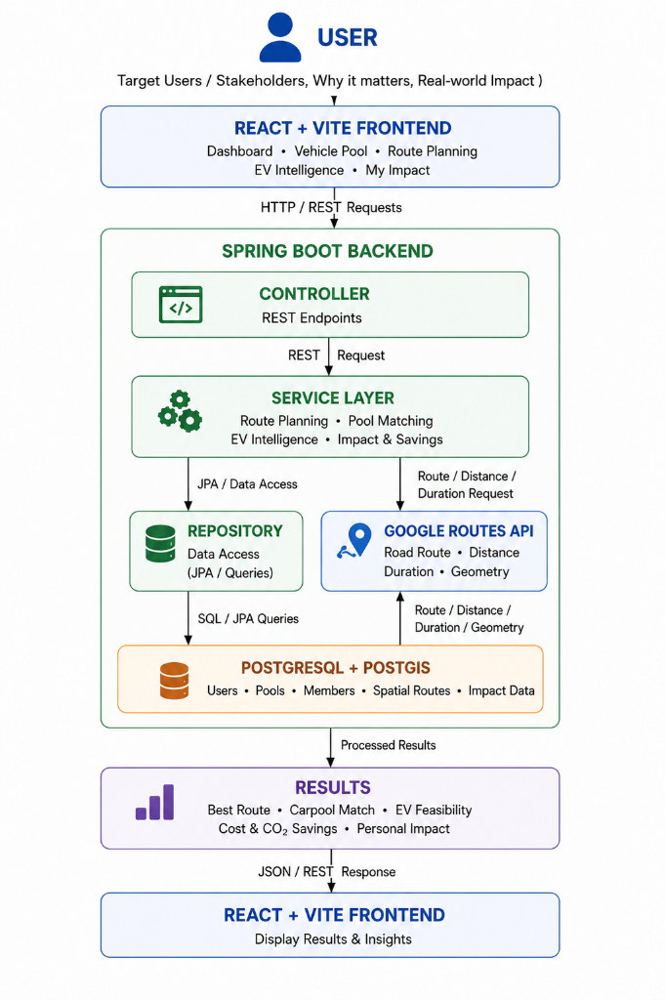
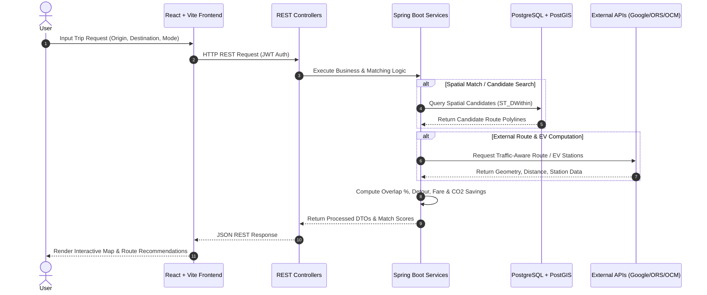

# 🌱 GreenMove

### Sustainable Multimodal Transportation & Mobility Platform

> Turn every journey into a smarter, more sustainable transportation decision.

[](https://opensource.org/licenses/MIT)
[]()
[](https://spring.io/projects/spring-boot)
[](https://vitejs.dev/)
[](https://postgis.net/)

---

## 📌 Executive Summary

Modern urban transit applications force commuters to choose between fragmented solutions: navigation tools focus solely on speed from point A to B, ride-sharing platforms prioritize driver matching without environmental awareness, and EV apps display isolated charging stations.

**GreenMove** bridges these gaps by establishing a unified **transportation decision system**. It connects EV range intelligence, spatial vehicle pooling, multi-provider route planning, and dynamic environmental impact calculations into a single intelligent platform.

$$\text{Decision Matrix} = f(\text{Distance}, \text{Duration}, \text{Financial Cost}, \text{Occupancy}, \text{CO}_2 \text{ Footprint})$$

---

## 🚨 Problem vs. GreenMove Approach

```
┌─────────────────────────────────────────────────────────────────────────┐
│                              THE PROBLEM                                │
│  • Fragmented Mobility Tools: Users switch between 3-4 separate apps.    │
│  • Ignored Occupancy: Solo driving consumes fuel & increases congestion. │
│  • EV Range Anxiety: Unplanned EV trips risk running out of charge.     │
│  • Opaque Impact: Commuters lack real data on their carbon savings.     │
└────────────────────────────────────┬────────────────────────────────────┘
                                     │
                                     ▼
┌─────────────────────────────────────────────────────────────────────────┐
│                          GREENMOVE APPROACH                             │
│  An integrated mobility decision layer combining EV trip safety, spatial │
│  vehicle pooling, multi-engine routing, and real-time impact metrics.   │
└────────────────────────────────────┬────────────────────────────────────┘
                                     │
                                     ▼
┌─────────────────────────────────────────────────────────────────────────┐
│                           KEY CAPABILITIES                              │
│  1. 🔋 EV Intelligence & Charging Corridor Discovery                    │
│  2. 🚗 Spatial Vehicle Pool & Route-Overlap Matching                    │
│  3. 🗺️ Multi-Provider Resilient Route Planning                          │
│  4. 📊 Personal & Shared Impact / Financial Savings Dashboard            │
└─────────────────────────────────────────────────────────────────────────┘
```

---

## 💡 Why GreenMove?

| Capability | Traditional Navigation | Ride Sharing | EV Tools | GreenMove |
| :--- | :---: | :---: | :---: | :---: |
| **Route Planning** | ✓ | Limited | ✓ | **✓** |
| **EV Trip Intelligence** | Limited | ✗ | ✓ | **✓** |
| **Spatial Carpool Matching** | ✗ | ✓ | ✗ | **✓** |
| **Occupancy-Aware Analysis** | Limited | ✓ | ✗ | **✓** |
| **Cost & Fare Calculations** | ✓ | ✓ | Limited | **✓** |
| **$\text{CO}_2$ Footprint Comparison** | Limited | Limited | ✓ | **✓** |
| **Personal Sustainability Impact** | ✗ | Limited | Limited | **✓** |

---

## 🚀 Core Features

### 🔋 PRIORITY 1 — EV Intelligence

GreenMove evaluates Electric Vehicle feasibility before and during a trip by cross-referencing vehicle battery state, consumption efficiency, and total route distance against verified charging infrastructure.

```
User Vehicle & Battery State (Capacity, Charge %, Efficiency)
                          ↓
               Total Route Distance (km)
                          ↓
      Range & Feasibility Analysis (Safe / Charging Required)
                          ↓
   Charging Station Discovery (5.0 km Corridor Search via OpenChargeMap)
                          ↓
          EV Trip Safety Recommendation & Station Markers
```

#### Key Technical Capabilities:
- **Range & Battery Awareness**: Evaluates available range $R_{\text{avail}} = \text{Capacity (kWh)} \times \left(\frac{\text{Charge } \%}{100}\right) \times \text{Efficiency (km/kWh)}$ against destination distance.
- **Corridor Search**: Discovers charging stations within a $5.0\text{ km}$ buffer along the route geometry using OpenChargeMap API integration.
- **Station Infrastructure Insights**: Displays verified connector types, power ratings (kW), address, and distance from route corridor.
- **Feasibility Statuses**: Categorizes trips into `SAFE` (sufficient charge), `CHARGING_REQUIRED` (suggests route chargers), or `CRITICAL`.

---

### 🚗 PRIORITY 2 — Vehicle Pool & Spatial Matching

GreenMove does **not** perform naive destination-only matching. Instead, it utilizes PostGIS spatial indexing and geometric route-overlap algorithms to match passengers with drivers travelling along compatible corridors.

```
                    Driver Creates Pool (Route Geometry Stored)
                                       ↓
                PostGIS Spatial Indexing (ST_DWithin 3000m Buffer)
                                       ↓
             Candidate Filtering (Pickup & Drop-off Proximity)
                                       ↓
         Route Direction Compatibility (Pickup Index < Dropoff Index)
                                       ↓
              Detour & Time Evaluation (≤ 30% Max Detour Limit)
                                       ↓
               Composite Match Score Calculation (0 - 100)
                                       ↓
               Passenger Joins Pool & Dynamic Fare Applied
```

#### Matching Criteria:
1. **Spatial Proximity**: PostGIS `ST_DWithin` filters drivers passing within $3,000\text{m}$ of passenger pickup and dropoff points.
2. **Direction Compatibility**: Verified via line-string fraction position ($\text{position}_{\text{pickup}} < \text{position}_{\text{dropoff}}$).
3. **Detour Bounds**: Enforces maximum driver detour constraints ($\le 30\%$ additional distance and $\le 10\text{ km}$ absolute detour).
4. **Resilient JTS Fallback**: Evaluates in-memory Java Topology Suite (`LengthIndexedLine`) when operating in environments without native PostGIS extensions.
5. **Fair Dynamic Pricing**: Calculates per-passenger fares based on driver rate per km and actual shared passenger segment distance:

$$\text{Passenger Fare} = \text{RatePerKm} \times \text{Distance}_{\text{passenger\_segment}}$$

---

### 🗺️ PRIORITY 3 — Resilient Route Planning

GreenMove incorporates a multi-provider routing architecture that prevents single-point-of-failure routing outages.

```
                      Primary: Google Routes API v2
                                   │
                           (If Unconfigured/Failed)
                                   ▼
                     Fallback 1: OpenRouteService
                                   │
                           (If Unconfigured/Failed)
                                   ▼
                        Fallback 2: Keyless OSRM
                                   │
                           (If Unconfigured/Failed)
                                   ▼
                      Fallback 3: Geodesic Haversine
```

#### Why This Architecture Matters:
- **High Availability**: Fallback layers ensure route calculation never fails even during external API downtime or rate-limit exhaustion.
- **Multimodal Evaluation**: Simultaneously computes and compares Driving, Transit, Cycling, and Walking options.
- **Traffic-Aware Re-routing**: Periodically checks for faster routes and prompts commuters when significant time savings are detected.

---

### 📊 PRIORITY 4 — Impact & Savings Engine

GreenMove measures personal and community sustainability contributions directly from completed journeys.

#### Calculation Formulas:
- **Solo Driving Cost**:
  $$\text{Solo Cost} = \left(\frac{\text{Distance (km)}}{\text{Vehicle Efficiency (km/l)}}\right) \times \text{Fuel Price (\text{₹}/l)}$$

- **Carpool Cost**:
  $$\text{Carpool Cost} = \text{Passenger Fare}$$

- **Realized Money Saved**:
  $$\text{Money Saved} = \max(0, \text{Solo Cost} - \text{Carpool Cost})$$

- **$\text{CO}_2$ Emissions Saved**:
  $$\text{CO}_2 \text{ Saved (kg)} = \left(\frac{\text{Distance (km)}}{\text{Efficiency}}\right) \times \text{Emission Factor}$$
  *(Emission Factors: Petrol $= 2.3\text{ kg/l}$, Diesel $= 2.7\text{ kg/l}$, CNG $= 1.8\text{ kg/l}$, EV Electricity $= 0.8\text{ kg/kWh}$)*

- **Eco Score**: Composite index ($0 - 100$) derived from completed pools, $\text{CO}_2$ avoided, and shared distance.

> [!NOTE]
> **Transparency Notice**: Driver earnings are tracked separately as `carpoolEarnings` and are never mislabeled as "Money Saved". Financial and environmental impact figures are comparative estimates calculated using configured vehicle efficiency factors.

---

## 🏗️ System Architecture


```
                               ┌──────────────┐
                               │     USER     │
                               └──────┬───────┘
                                      │
                                      ▼
                      ┌───────────────────────────────┐
                      │    REACT + VITE FRONTEND      │
                      │  Dashboard • Vehicle Pool     │
                      │  Plan Route • EV Intelligence │
                      │  My Impact • Profile Settings │
                      └───────────────┬───────────────┘
                                      │ HTTP / REST
                                      ▼
                      ┌───────────────────────────────┐
                      │     SPRING BOOT BACKEND       │
                      │  ┌─────────────────────────┐  │
                      │  │       CONTROLLER        │  │
                      │  └────────────┬────────────┘  │
                      │               ▼               │
                      │  ┌─────────────────────────┐  │
                      │  │      SERVICE LAYER      │  │
                      │  └──────┬────────────┬─────┘  │
                      │         │            │        │
                      │         ▼            ▼        │
                      │  ┌───────────┐  ┌───────────┐ │
                      │  │ REPOSITORY│  │ GOOGLE    │ │
                      │  └─────┬─────┘  │ ROUTES    │ │
                      │        │        └─────┬─────┘ │
                      │        ▼              │       │
                      │  ┌─────────────────────────┐  │
                      │  │   POSTGRESQL + POSTGIS  │  │
                      │  └─────────────────────────┘  │
                      └───────────────┬───────────────┘
                                      │ Processed JSON
                                      ▼
                      ┌───────────────────────────────┐
                      │    REACT + VITE FRONTEND      │
                      │  (Display Results & Insights) │
                      └───────────────────────────────┘
```

---

## 🔄 Data Flow





### Flow Summary:
`User Input` $\rightarrow$ `Frontend` $\rightarrow$ `Backend Controller` $\rightarrow$ `Service Layer` $\rightarrow$ `Database / External APIs` $\rightarrow$ `Processed Results` $\rightarrow$ `Frontend UI` $\rightarrow$ `User Insights`.

---

## 🧩 Feature Architecture & Module Breakdown

### 1. 🔋 EV Intelligence Module
- **Purpose**: Evaluates EV trip range safety and discovers corridor charging stations.
- **Input**: Vehicle battery capacity, current charge %, efficiency, origin, destination.
- **Processing**: Calculates total distance vs range; performs $5\text{ km}$ corridor spatial search via OpenChargeMap API.
- **Output**: Feasibility status (`SAFE` / `CHARGING_REQUIRED`), charging station list with connectors and kW power ratings.

### 2. 🚗 Vehicle Pool Matching Module
- **Purpose**: Matches drivers and passengers based on route geometry compatibility.
- **Input**: Origin/Destination coordinates, departure time, seat requirements.
- **Processing**: PostGIS spatial proximity search (`ST_DWithin`), direction check ($\text{pickup} < \text{dropoff}$), detour calculation ($\le 30\%$).
- **Output**: Ranked candidate pool list, match scores ($0-100$), passenger segment fares.

### 3. 🗺️ Route Planning Module
- **Purpose**: Provides multimodal travel recommendations with resilient fallback.
- **Input**: Start point, end point, transit preferences, avoid tolls flag.
- **Processing**: Executes routing fallback pipeline (Google Routes v2 $\rightarrow$ OpenRouteService $\rightarrow$ OSRM); calculates time, cost, and $\text{CO}_2$.
- **Output**: Primary & alternative routes, multimodal comparison matrix (Driving, Transit, Cycling, Walking).

### 4. 📊 Impact & Savings Module
- **Purpose**: Tracks environmental and financial contributions of completed trips.
- **Input**: Completed trip records, member statuses (`CREDITED`), user vehicle fuel type.
- **Processing**: Computes solo cost vs carpool cost, applies fuel emission factors ($\text{kg CO}_2/\text{l}$), updates cumulative metrics.
- **Output**: Eco Score, total money saved, $\text{CO}_2$ saved (kg), solo trips avoided.

### 5. 🔐 Authentication & Security Module
- **Purpose**: Manages secure user access and profile settings.
- **Input**: User credentials (email/password or Google OAuth ID token).
- **Processing**: BCrypt password verification, Google token validation, JWT generation.
- **Output**: Signed JWT access token, authenticated user session context.

---

## 🛠️ Technology Stack

```
   FRONTEND                        BACKEND                         DATABASE & APIS
┌──────────────┐                ┌──────────────┐                ┌──────────────────┐
│  React 18    │                │ Java 21      │                │ PostgreSQL 16    │
│  Vite 8      │                │ Spring Boot  │                │ PostGIS 3.4      │
│  Tailwind    │                │ Spring Sec.  │                │ Google Routes v2 │
│  MapLibre GL │                │ JPA / H2     │                │ OpenChargeMap    │
└──────────────┘                └──────────────┘                └──────────────────┘
```

### Frontend
- **Framework**: React 18 with Vite 8
- **Styling**: Tailwind CSS with custom design tokens
- **Mapping**: MapLibre GL & Leaflet for interactive GIS visualization
- **Icons**: Google Material Symbols Outlined

### Backend
- **Framework**: Java 21 & Spring Boot 3.4.2
- **Security**: Spring Security with JWT (JSON Web Tokens) & Google OAuth 2.0 Token Verification
- **ORM / Data Access**: Spring Data JPA & Hibernate Spatial (JTS Precision Model)
- **Database Migrations**: Flyway SQL Migrations (`V1__` through `V15__`)

### Database & Spatial Storage
- **Production Database**: PostgreSQL with PostGIS extension (Spatial reference system SRID 4326)
- **Local Dev / Testing Database**: In-memory H2 Database with H2GIS spatial dialect support

### External Service Integrations
- **Routing Engines**: Google Routes API v2, OpenRouteService, OSRM (Open Source Routing Machine)
- **EV Data**: OpenChargeMap API
- **Geocoding**: MapTiler Geocoding API & OpenStreetMap Nominatim
- **Email Service**: Brevo Transactional Email API (with Console fallback)

---

## 🔐 Security & Secret Protection

- **Stateless JWT Security**: Requests to protected endpoints (`/api/v1/pools/**`, `/api/v1/impact/**`, `/api/v1/profile/**`) require a valid Bearer JWT header.
- **Google OAuth 2.0 Verification**: ID tokens issued by Google are verified on the backend using Google's public key certificate verifier (`GoogleTokenVerifierService`).
- **Password Hashing**: User passwords are encrypted using BCrypt password encoder (`BCryptPasswordEncoder`).
- **Role-Based Authorization**: Enforces role checks (`USER`, `ADMIN`) across sensitive endpoints.
- **Email Verification**: Brand-new registrations generate a secure 24-hour verification token.

> [!IMPORTANT]
> **Secret Protection Guarantee**: Secrets and API keys (`JWT_SECRET`, `GOOGLE_ROUTES_API_KEY`, `VITE_MAPTILER_API_KEY`, `SPRING_DATASOURCE_PASSWORD`) are injected exclusively via environment variables and are **never committed to version control**.

---

## 📈 Scalability & Reliability

GreenMove is architected for seamless cloud scale:

- **Stateless REST Layer**: The Spring Boot backend maintains zero session state, enabling horizontal scaling behind a load balancer.
- **Spatial Indexing**: PostGIS R-Tree indexes (`GIST`) on `route_geom`, `start_point`, and `destination_point` ensure spatial queries run in $O(\log N)$ time even with large pool datasets.
- **Circuit-Breaker Fallback Pipeline**: Routing calls automatically fallback from Google Routes to OpenRouteService and OSRM, preventing system unavailability during third-party API outages.
- **Modular Monolith Architecture**: Decoupled domain services (`EVChargingService`, `VehiclePoolService`, `RoutingService`) allow easy extraction into microservices if traffic demands grow.

---

## ⚠️ Current Limitations

- **Emission Calculations**: $\text{CO}_2$ savings are comparative estimates derived from standardized fuel factors rather than direct OBD-II vehicle telemetry.
- **External API Rate Limits**: Route calculation speeds depend on third-party provider response times and API tier limits.
- **EV Charger Live Status**: Station availability depends on data provided by OpenChargeMap.

---

## 🔮 Future Scope & Roadmap

### 📱 Mobile App (iOS / Android)
Extend GreenMove into native mobile applications built with React Native for real-time turn-by-turn navigation.

### 🎙️ AI Voice Assistant
Integrate natural language voice queries allowing commuters to request rides and check charging stations hands-free.

### 🧠 Predictive Personal Mobility
Apply machine learning to user travel history for automated route and departure time recommendations.

### 🌐 Smart Mobility Ecosystem
Integrate public transit ticketing, micro-mobility (e-bikes/scooters), and municipal parking systems into one seamless pass.

### 💼 Enterprise Partnership Network
Partner with corporate campuses and municipal transit authorities to offer subsidized employee carpooling.

---

## 📸 Application Preview

```
┌───────────────────────────────────────────────────────────────────────────┐
│                           1. EV INTELLIGENCE                              │
│   • Battery Range Feasibility Analysis                                    │
│   • OpenChargeMap Corridor Discovery                                      │
└───────────────────────────────────────────────────────────────────────────┘
┌───────────────────────────────────────────────────────────────────────────┐
│                           2. VEHICLE POOL                                 │
│   • PostGIS Route-Overlap Matching                                        │
│   • Detour & Proximity Match Scores                                       │
└───────────────────────────────────────────────────────────────────────────┘
┌───────────────────────────────────────────────────────────────────────────┐
│                           3. ROUTE PLANNING                               │
│   • Multimodal Comparison (Driving, Transit, Cycling, Walking)           │
│   • Live Traffic Re-routing & Fallback Pipeline                           │
└───────────────────────────────────────────────────────────────────────────┘
┌───────────────────────────────────────────────────────────────────────────┐
│                           4. IMPACT & SAVINGS                             │
│   • Realized Savings & CO2 Metrics Dashboard                              │
│   • Personal Eco Score & Achievements                                     │
└───────────────────────────────────────────────────────────────────────────┘
```

---

## 🎥 Demo & Links

- **Live Application**: [https://greenmove.onrender.com](https://greenmove.onrender.com) *(Demo placeholder)*
- **GitHub Repository**: [https://github.com/Nandini-Chourasiya/GreenMove](https://github.com/Nandini-Chourasiya/GreenMove)

---

## 💻 Local Development Setup

### Prerequisites
- **Node.js**: v18.x or higher
- **Java JDK**: 21 or higher
- **Maven**: 3.8+ (or use included `.\mvnw.cmd`)
- **PostgreSQL**: 16+ with PostGIS extension (Optional; H2 database is embedded for instant local development)

### 1. Clone Repository
```bash
git clone https://github.com/Nandini-Chourasiya/GreenMove.git
cd GreenMove
```

### 2. Frontend Setup
```bash
# Install frontend dependencies
npm install

# Start Vite development server
npm run dev
```
Frontend will start at `http://localhost:5173` (or `http://localhost:5174`).

### 3. Backend Setup
```bash
cd backend

# Run Spring Boot backend with local test profile (H2 in-memory DB)
.\mvnw.cmd spring-boot:run "-Dspring-boot.run.arguments=--spring.profiles.active=test"
```
Backend API will start at `http://localhost:8080`.

---

## 📚 Research & References

### APIs & Documentation
- [Google Routes API v2](https://developers.google.com/maps/documentation/routes)
- [OpenChargeMap API](https://openchargemap.org/site/develop/api)
- [OpenRouteService API](https://openrouteservice.org/dev/#/api-docs)
- [OSRM (Open Source Routing Machine)](http://project-osrm.org/)
- [MapTiler Geocoding](https://docs.maptiler.com/cloud/api/geocoding/)
- [Google OAuth 2.0](https://developers.google.com/identity/gsi/web)
- [Brevo Transactional Email](https://developers.brevo.com/)

### Core Technologies
- [Spring Boot 3.4 Documentation](https://docs.spring.io/spring-boot/index.html)
- [React 18 Documentation](https://react.dev/)
- [PostGIS Spatial Database Reference](https://postgis.net/documentation/)
- [Flyway Database Migrations](https://documentation.red-gate.com/flyway)

---

## 👤 Author & Team

**GreenMove Team**
- **Repository**: [Nandini-Chourasiya/GreenMove](https://github.com/Nandini-Chourasiya/GreenMove)
- **License**: Released under the [MIT License](LICENSE).
